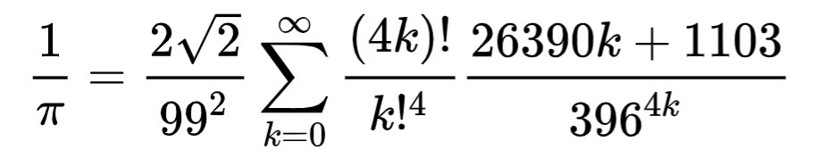

```{r,echo=F}
knitr::opts_chunk$set(
  cache=T,
  collapse=T,
  comment="#>"
)
```

### Introduction

[Srinivasa Ramanujan](https://en.wikipedia.org/wiki/Srinivasa_Ramanujan) was one of history's most gifted Mathematicians. In 1917 he discovered the following formula for 1/π known as the "[Ramanujan-Sato Series](https://en.wikipedia.org/wiki/Ramanujan%E2%80%93Sato_series)": 

```{r,echo=F,out.width="50%",fig.align="center"}

```

The incredible thing about this formula is its exponential speed of convergence, owing to the $396^(4k)$ term in the denominator. This also places high requirements on number representation precision.

Even for small k, this term will quickly require more significant digits than provided by floating-point numbers in most programming languages. As an example, suppose k=4. R uses 53-bit doubles, which can represent up to 22 significant digits:

```{r}
print(396^(4*4),digits=22)
```

Via the arbitrary-precision [Rmpfr](https://cran.r-project.org/web/packages/Rmpfr/vignettes/Rmpfr-pkg.pdf) package (use, say 120 bits), we can see the number above is actually an integer w/ 42 digits:

```{r}
Rmpfr::mpfr(396, 120)^(4*4)
```

So in what follows we will be using this library.

### Load the arbitrary-precision library

```{r,message=F}
library(Rmpfr) # use this for arbitrary-precision floats
```

We will be using 120 bits of representation precision:

```{r}
bits <- 120
```

One term of the R-S series and its front coefficient:

```{r}
sqrt2 <- sqrt(mpfr(2L, bits))
rs_coeff <- 9801L/(2L*sqrt2)

rs_term <- function(k) {
  num <- factorial(4L*k)*(26390L*k+1103L)
  den <- (factorial(k)*(396L^k))^4L
  num/den
}
```

Calculates π w/ kmax iterations of the R-S formula:

```{r}
rs_series <- function(kmax) {
  terms <- rs_term(mpfr(0:(kmax-1),bits))
  (rs_coeff/cumsum(terms))
}
```

### Calculate π

Only 5 iterations and we're pretty close:

```{r}
rs_series(5)
```

Error from π computed internally by Rmpfr:

```{r}
rs_series(5)-Const("pi",bits)
```

Mind-blowing convergence of π digits through the Ramanujan-Sato series! `r emo::ji("smile")`

***

### References:

* N. Baruah, B. Berndt, H. Chan, "Ramanujan’s Series for 1/π: A Survey", Mathematical Association of America, Aug-Sept 2009. [pdf](https://faculty.math.illinois.edu/~berndt/articles/monthly567-587.pdf)
* Wikipedia, "[Srinivasa Ramanujan](https://en.wikipedia.org/wiki/Srinivasa_Ramanujan)"
* M. Mächler, "Arbitrarily Accurate Computation with R: The Rmpfr Package", ETH Zurich, 2019. [pdf](https://cran.r-project.org/web/packages/Rmpfr/vignettes/Rmpfr-pkg.pdf)

***

© 2019 Dan S. Reznik
